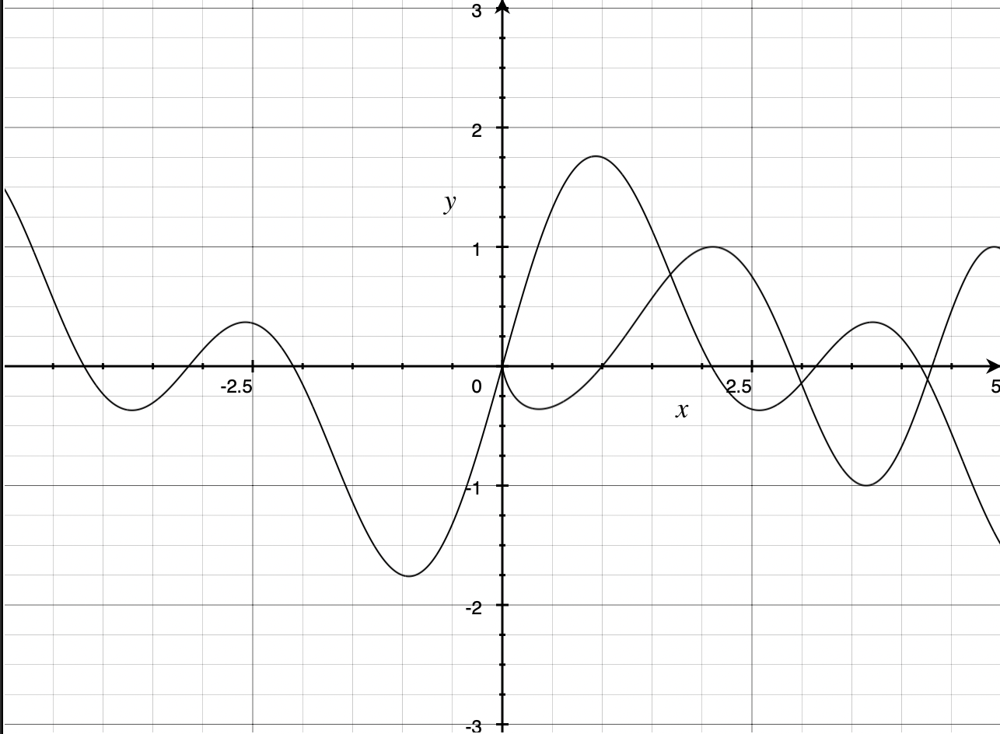

+++
path = "/blog/2025/12/24/resurrecting-my-old-turbo-pascal-homework-with-ai/"
title = "Resurrecting my old Turbo Pascal homework with AI"
date = "2025-12-24"
description = ""
[taxonomies]
categories = ["blog"]
tags = ["ai", "turbo-pascal", "nostalgia"]
+++

## Let me take you back in time...

The year is 1995, I'm studying for my A-Levels[^1], the Dot Com Boom hasn't even started yet let alone crashed. The horrors of the 21st Century have yet to come. The world is my oyster.

Being a bit of a nerd, I chose Computing as one of my subjects. A-Level Computing was an odd subject, it wasn't really Computer Science, but it wasn't just "IT Studies" either, it covered a lot of the basics: sorting algorithms, what two's complement is, all that sort of thing. It also had a lot of hands-on programming, and the final grade was half exam and half an original project.

The Computing room (which was dedicated to the subject, there were general purpose computer facilities for other subjects) was filled with 486 PCs, running MS-DOS and [Turbo Pascal 7.0](https://en.wikipedia.org/wiki/Turbo_Pascal). These were already out-of-date for the time, Windows 95 was about to be released, Turbo Pascal's last release was more than two years previously, but it was a genuinely fun environment to work in. It was a full compiler, but the IDE was very interactive, it had the simplicity of being able to go from zero to something tangible very quickly, just press Ctrl-F9 and away you go. (Ah those were the days, I can safely say today, after a day in the [YAML mines](https://en.wikipedia.org/wiki/Kubernetes).) I can see why some places were still using Turbo Pascal for teaching much later than 1995.

At the start of the second year, we had to choose a project. The choice was quite free, but it had to be something substantial and original, although what "original" meant was unclear. It didn't have to be something academically original, like the criteria for a degree-level dissertation, but it couldn't be just a tweak of something that already existed. I chose to create a graphing calculator, which wasn't an original idea by any means, but I justified it on the grounds that I couldn't find one for DOS (doing a quick search now finds dozens, but I didn't know them at the time).

I began the work in complete and total ignorance of what I needed to do. I'd done programming before, well before A-Levels, I'd been tinkering ever since the 8-bit BASICs as well as the first-year programming projects in Turbo Pascal. But I didn't know anything about graphics calculators (apart from using a physical one in my A-Level Maths homework), yet in an odd way that was kind of a bonus. "How hard can it be?" is a legit source of energy. Surely just start at the left, calculate Y for a given X and update the line?

Turbo Pascal was a "batteries included" platform, it had graphics libraries (e.g. [BGI](https://en.wikipedia.org/wiki/Borland_Graphics_Interface)), so getting lines on the screen was trivially easy. It was very similar to the good old 8-bit BASICs in that sense.

I distinctly remember the first painful part, that was when I was trying to create a rudimentary UI. Buttons to navigate the screen, zoom in/out, that sort of thing. It felt like it took a month to get that part working. How the hell was I going to get the rest of it done? We essentially had all year to do it, but still...

...of course with the benefit of hindsight none of that was unusual in software projects. Some things always take disproportionately longer than others, it's the main reason why estimating software projects is so often wrong...

I ended up creating a custom unit called `Button` ("unit" is what Turbo Pascal calls what would be called a module, or package, in other languages), because that was all it did. It defined a function to reset the screen, a function to draw a button, and a function to check if a button was pressed. The rest of the UI was in the main code itself, using Turbo Pascal's Graph unit.

That was the most painful part of the project, so I need not have worried. Once I'd found a way forward, adding other features was straightforward. I just piled-on features, working on it most Wednesdays, until I ran out of time, then submitted the completed code.

Despite beginning with no idea what I was doing, and despite some of the code containing embarrassing howlers (more on these later), some parts were genuinely sophisticated. Not cutting edge of course, but sophisticated in the sense that it used classical algorithms that I was only partially familiar with. For example it included an implementation of the [Shunting Yard algorithm](https://en.wikipedia.org/wiki/Shunting_yard_algorithm) to parse the equation in to Reverse Polish Notation, which was then used to evaluate `y` for a given `x`, but I didn't know it was called that at the time, it was years later when I had the "oh so that's what it's called" moment. Because of that, there's no mention of "shunting" or "yard" in the code, nor Reverse Polish Notation for that matter. I'd implemented it from memory, it had been briefly mentioned in one of the classroom sessions in the first-year.

The project did the trick and got me an A-grade (A*-grades hadn't been invented yet). I went on to study Computer Science at university, where I learned much more about the theory as well as the practicalities of programming. My degree dissertation was a much more involved project, much more academically rigorous, but I still felt more... what's the word, pride I suppose... for the calculator because it was a tangible tool that you could just use. My degree disseration, on the other hand, was abstract, required a lot of data to start with and basically produced just a different lot of data that wasn't much to look at.

The only problem was... the calculator didn't run anymore. Being royally fed-up with the terrible operating systems that were Windows 95 and Windows 98, I had adopted Windows NT, I'd got a student licence and installed NT 4.0 on a self-built PC that also dual-booted Linux. My DOS calculator didn't run on either, and couldn't be simply recompiled for a different target due to BGI and other things being DOS-only.

Unix code in the 1970s may still compile on modern Unix systems. IBM mainframe code from the 1960s may even run unmodified on modern IBM systems. But code written for Microsoft's premier platform in 1995 (this project started just before Windows 95 was released) didn't run on Microsoft's premier platform less than five years later.

Over the years I'd thought of different ways of resurrecting it, but never got round to it. There was always something more important going on with my time.

But I had (most of) the source code safely archived...

## The calculator

Let's talk about the calculator itself.

It was a DOS application, I seem to recall it wasn't even an EXE it was a [COM executable](https://en.wikipedia.org/wiki/COM_file) as that was the default and I never saw much reason to change it, but that did mean it had a strict memory limit of 64KB even though it ran on machines with 4 or 8MB of RAM.

The functionality was a subset of what you'd see in a physical graphical calculator of the time. You could enter two equations (and only two, because of the 64KB limit), then you could plot them on screen. You could zoom in and out, including a crude click-and-drag box to zoom in to. You could pan around. You could then calculate: intersections, roots, etc. As I said above I basically added features until I ran out of time, there wasn't a set specification. Because of this there are a number of notable omissions: you can use natural logarithms in the equations, but not base 10 logarithms, for example. The code also has features that you can't get to in the UI, for example a random number generator.

Looking at the code now (I'll include a link below, but let me get my excuses in first), I'm struck by three emotions: amusement, embarrassment but also I'm quite impressed.

The code structure is basically one big file. With two exceptions, two custom units. One was the Button unit, which I mentioned above. The other was a `Stack` unit, which was just that. Everything else was in one single file that handled everything. It's approximately 2000 lines of code, and is old-school Pascal, none of that Object Pascal (even though Turbo Pascal 7 supported it), just procedural code. With a lot of global state.

This isn't how I'd structure a tool today, of course, but it wasn't bad in context of a self-contained project at the time. The aforementioned Stack unit, for example, was just one (well two, there was a string stack and a number stack) global stack, shared by multiple functions. But, because the code was single-threaded the stack was never under contention, one function had finished with it before the next started, so it worked.

The amusement factor comes from the way the code reads like I was both in a rush and had a headache when writing it. Numerous cases of placeholder names (variables called `thing` and procedures like `Initinitinit`, which is called by `Initinit` obviously - there is no `Init` for some reason).

The embarrassment factor overlaps with this, bad naming conventions, odd cases of supreme hubris (the word "magnificent" is used to describe the calculator). Terms like "equation" and "formula" are used to mean the same thing. But also I created functions that must have already existed in the standard library. For example:

```pascal
Function stringtoreal(string1 : string) : real;
         Var
            answer       : real;
            decimalpoint : integer;
            i            : integer;
            j            : real;
            number       : real;

         Begin
              decimalpoint := 0;
              answer := 0;
              number := 0;
              Repeat
                    inc(decimalpoint);
              Until (string1[decimalpoint] = '.') or (decimalpoint > length(string1));
              j := 1;
              For i := (decimalpoint - 1) downto 1 do
              begin
                   If string1[i] = '0' then number := 0;
                   If string1[i] = '1' then number := 1;
                   If string1[i] = '2' then number := 2;
                   If string1[i] = '3' then number := 3;
                   If string1[i] = '4' then number := 4;
                   If string1[i] = '5' then number := 5;
                   If string1[i] = '6' then number := 6;
                   If string1[i] = '7' then number := 7;
                   If string1[i] = '8' then number := 8;
                   If string1[i] = '9' then number := 9;
                   answer := answer + (number * j);
                   j := j * 10;
              end;
              j := 0.1;
              if decimalpoint < length(string1) then
                 For i := (decimalpoint + 1) to length(string1) do
                 begin
                      If string1[i] = '0' then number := 0;
                      If string1[i] = '1' then number := 1;
                      If string1[i] = '2' then number := 2;
                      If string1[i] = '3' then number := 3;
                      If string1[i] = '4' then number := 4;
                      If string1[i] = '5' then number := 5;
                      If string1[i] = '6' then number := 6;
                      If string1[i] = '7' then number := 7;
                      If string1[i] = '8' then number := 8;
                      If string1[i] = '9' then number := 9;
                      answer := answer + (number * j);
                      j := j * 0.1
                 end;
              stringtoreal := answer;
         end;
```

This must have been in the standard library somewhere. I don't think I even bothered to check, I was on a mission, the code just came out.

But I'm quite impressed by it, despite all that, because its actually quite readable. You can go through it from start to finish and understand what it's doing. I can't say that about a hell of a lot of software systems I've worked on in the intervening years.

### Some code examples

Just as a sampler, let's have a look at some code snippets. These tell a story.

```pascal
Uses Button, Mouse, Graph, Crt, Stack;
```

These were the only "external" dependencies, and two of them were written by me. Two were provided by Turbo Pascal. The `Mouse` unit came from, I can't remember, I remember giving credit to a third-party when submitting the project for review. But I honestly can't remember where it came from. I have vague memory of using the one computer that had a 14.4k modem to access a Turbo Pascal focused FTP server (those were the days), so that may have been it. If so it was the first time I'd used a centralised internet code repository.

I've tried searching for the function signatures, to see if that code still exists in the large today, or at least in some kind of historic Turbo Pascal archive. But to no avail. Or at least not an exact fit. I did find a edition of Byte magazine from 1985 that had an article called ["Turbo Pascal Drives the Mouse" by John Figueras](https://vintageapple.org/byte/pdf/198509_Byte_Magazine_Vol_10-09_10th_Anniversary_Issue.pdf), the functions exposed by that unit match the function names in the one I used, but the parameters were slightly different. It seems most likely that the version I used was a derivation of the one in the article.

```pascal
type
    angletype = (Deg,Rad);
    proctypes = (SX,DX);
```

I'm still impressed by how easy it was to do enums in Pascal. But these two tell us *a lot*. The first is simple, the calculator's trigonometric functions could work in degrees or radians, and had a config screen to switch between the two. The second, what could SX or DX mean? Yes... we're back to embarrassment again... because my homebrew UI buttons library was not very sophisticated, it had a crude delay built-in, and the length of the delay needed to be customised for the machine in question. SX meant it ran on a 486SX (as I had at home), DX meant it ran on a 486DX (as we had in the computer room). It was very difficult to navigate if set to the wrong processor.

Now we're seeing some of the real reasons why resurrecting this code will be difficult, it'll need many changes for it to even work on a modern machine, unless it was under an emulator deliberately slowed down.

There are some unused functions in here too. Obviously abandoned features or unfinished features.

The main data structures are global variables and modified directly by procedures. The implementation of the Shunting Yard algorithm shows this:

```pascal
Procedure Postorderit(equ : integer);
          Var
             i, j      : integer;
             temp      : string;

          Begin
               j := 1;
               initthing;
               For i := 1 to sizeofnewformulaarray do
               begin
                    If newformulaarray[i][1] in ['A'..'Z','e'] then
                    begin
                         newimprovedformula[equ,j] := newformulaarray[i][1];
                         inc(j);
                    end;
                    if isitehh(i) then
                       push(newformulaarray[i]);
                    if newformulaarray[i] = ')' then
                    begin
                         temp := pop;
                         While (temp <> '(') do
                         Begin
                              newimprovedformula[equ,j] := temp;
                              temp := pop;
                              inc(j);
                         End;
                    end;
               end;
               While (topptr >= bottomptr) do
               begin
                    newimprovedformula[equ,j] := pop;
                    inc(j);
               end;
          end;
```

Basically the tokenised string is in `newformulaarray`, and the function builds a postfix expression in `newimprovedformula`.

The UI logic, such as it was (apart from the `Button` unit) was inline in the code, so the repeated pattern like below is often seen:

```pascal
Binit;
Defbutton('Show buttons',535,460,635,475,FALSE);
;
For i := 1 to (nextfree - 1) do
    drawbox(i);
Mshow;
Repeat
    Mpos(mousebits);
    buttonpressed := 0;
    If mousebits.buttonstatus = 1 then
       buttonpressed := whichbutton;
    If buttonpressed > 0 then
    begin
        ;
        swapindent(buttonpressed);
        ;
    end;
    If processor = DX then
        Delay(250);
    If processor = SX then
        Delay(100);
    Case buttonpressed of
        1 : Begin
            whichmode := Norm;
            exit := TRUE;
        end;
    end;
    If buttonpressed > 0 then
    begin
        Mhide;
        swapindent(buttonpressed);
        ;
    end;
Until (exit = TRUE);
```

`Binit` cleared all previous button state and assumed a blank screen. `Defbutton` defined a button. Then a loop ran (with the aforementioned CPU-specific delay) until a button was pressed. Which button was simply an integer that gave the number of the button in the order in which `Defbutton` was called initially. `swapindent` gave the effect of the button being pressed.

Some of the other examples are quite long, so I won't quote them in-line, I think it's time to link to the code in all its glory instead. The original code is here: [GRCLC120.PAS](https://github.com/benashford/grcalc/blob/master/original/GRCLC120.PAS)

The main "calculating" function was [`CalcY`](https://github.com/benashford/grcalc/blob/master/original/GRCLC120.PAS#L376-L454).

There's an absolutely mammoth function called `Displaycontrol`, (starts [here](https://github.com/benashford/grcalc/blob/master/original/GRCLC120.PAS#L534)) which was unusually accurately named, it was responsible for the display of the graph itself. Display of menus and settings, etc. were separate. All those functions made liberal use of Pascal's ability to nest functions and procedures, these were not closures or first-class functions as we'd expect them today (you couldn't return them or pass them as arguments, but they did have the ability to read and modify the parent's local variables); in this code they were mainly used as crude namespacing, if FunctionB was only ever called from FunctionA then it was nested inside FunctionA.

One feature I had completely forgotten until writing this is that it saved its settings on exit, and read it back on startup. This has made testing it easier.

## Resurrection attempts

Numerous times I had the idea to resurrect this code. But it was mostly idle thoughts, there was always something more important going on. The first semi-serious attempt was when I learned of the [DOSBox project](https://www.dosbox.com/). This looked like an obvious way forward, it was a full PC emulator running DOS so all the weirdnesses around VGA graphics and direct memory access wouldn't be a problem.

But there were some problems.

One was Turbo Pascal itself, I no longer owned a copy of it. Borland had released several versions for free shortly before their demise, but the most recent was Turbo Pascal 5.5 and I didn't know if it would work with that version. There was a risk I'd be chasing problems that didn't exist and were just version compatibility problems.

The second issue was the parts of the project that were missing entirely, the `Button`, `Stack` and the mystery `Mouse` units. I'd have to rebuild those from scratch, in an old IDE in a language I hadn't used for years, in an emulator. It was looking like quite a substantial chunk of work.

Of course I could have just ported it to a more modern platform, but the thought of that didn't satisfy my sense of nostalgia. I wanted my code as-was to run, so I could see it running again and compare against more recent code I'd written.

So it remained on my to-do list in perpetuity.

## AI

Fast forward back to 2025. Thirty years after I began work on my A-Level project, and the software world is very different. Some better, some worse.

Of all the things that have changed in that time, some others have changed less than I would have thought would change all the way back when. Anyone using Turbo Pascal in 1995 would recognise the current generation of IDEs as IDEs, similar to how a Unix shell is still a Unix shell after even longer periods of time.

But the single biggest thing is one of the newest, the availability of AI and especially AI-assisted tools (Copilot, Gemini, Claude Code, Codex, etc., etc., they're already near-ubiquitous I don't have to explain them here) that have been encroaching over the past few years.

In online forums there seems to be fairly extreme positions taken. Some people think AI will kill off software development in the next six months, others think none of it works and will never work. They can't both be right, but they can both be wrong. In practice these tools are rapidly becoming very common in less bombastic circumstances, people are becoming more adept at using them and knowing when and where they work well and also the opposite.

There are also some classic nerd wars starting (similar to Vi vs. Emacs of old). People claiming AI Product No. 1 is superior and only idiots use AI Product No. 2, etc. This one is the most baffling to me as, unlike Vi. vs Emacs where there's a large investment in getting the tool setup just right that you can't just switch between tools on a whim, with AI tools you can use more than one, often at the same time. I discovered by accident how potent using more than one model from different vendors can be when we setup Copilot Coding Agent at work as a trial, after Copilot has completed a PR, our custom code-review tool (not Copilot's Code Review, one we run locally and is more thorough) kicked-off and submitted several comments, which automatically triggered the Coding Agent again, etc. Looking through the back-and-forth afterwards was a bit of an eye-opener, two models (Copilot Coding Agent uses Claude Sonnet I believe, the reviewer was one of the OpenAI GPT models - I forget which one it was at the time) produced a high-quality PR that one tool alone wouldn't have done. It hadn't been my intent to test that exact scenario, but the outcome was surprisingly effective.

But, to bring us back to the point of this story, recently I had an idea...

...what if, I use AI to bring my 1990s vintage graphing calculator back to life?

I could use an AI agent to do all the hard work. I'd dig out the code, put it in a new directory, explain the problem and see how far we get. I wasn't going to prescribe any solution, there was just going to be one rule, the main code should have the fewest changes possible. I didn't want a reconstruction, I wanted my old code as-was to run. I would let the AI agent create some kind of harness to run it in.

## The resurrection

The first question was, which agent to use? At work we've used a few, but I wanted to use something else. I had recently downloaded [Google Antigravity](https://antigravity.google/) at home to try it out, so I decided to use that. Access to Gemini 3 Pro and Claude Opus 4.5, on paper it's quite a potent combination; and, a couple of days after I did the bulk of what is described in this post, Gemini 3 Flash was launched which I used to tidy-up some loose ends.

The second (quite fundamental) question was, which version of the code was the final one. What with it being the 90s at the time (git hadn't been invented), and my own inexperience of version control tools, the workflow I had was the classic "bump a number at the end of the file and save a copy" technique, as such my archive had many versions. The one with the highest number also had the latest timestamp (8th February 1996), so I went with that. I'm still not 100% sure that's the final version, I seem to recall good weather when I was polishing and submitting the project, not February weather at all, but it's the latest one I still have.

Then it was time to invoke the agent. I'm not claiming any magic prompt is the way forward, I just described the problem and invited the agent to make a plan. Starting with Claude Opus 4.5. I explained I wanted my code to be left alone if at all possible, and that some of the other units were missing and would need to be re-created.

It very quickly decided that the [Free Pascal Compiler](https://www.freepascal.org) was the way forward, as it has the ability to compile the Turbo Pascal dialect of Pascal, this should hopefully mean the bulk of my original code that survives would not need to be modified.

One area that took a while was the `Graph` unit. This was part of Turbo Pascal's standard library, and was DOS specific; and, not only DOS specific but VGA specific. It wasn't going to be able to run on my Mac in 2025, even if we did have the code for it. Free Pascal has a `Graph` unit, but again not well supported on Mac OS. The first choice of the AI agent was to use `ptcgraph`, as that seems to be (I say "seems" as it's far away from my area of expertise) to be the preferred option, however this also has issues with Mac OS. Where we ended up was SDL2 via the [SDL2-for-Pascal library](https://github.com/PascalGameDevelopment/SDL2-for-Pascal), on top of that Antigravity via Claude generated a new `Graph` unit, and also a `Mouse` unit that maintained the function signatures of the original.

The AI generated replacements for `Stack` and `Button` went remarkably smoothly.

Soon it was time to run it. A `make clean && make` and we're there. `./grcalc` and...

...completely blank window.

This involved a bit of back-and-forth, by which I mean I pasted a screenshot of a completely blank window only for the agent to realise it was because it forgot to set the colours correctly when drawing lines in the `Graph` unit.

At this point I exhausted my quota with Claude Opus 4.5, but it has been running for a good while by this point, I was surprised it got as far as it did. So I switched to Gemini 3 Pro to continue.

There were still a couple of problems to workout. One was some weird timing problem where it would only show the graph for a brief second, then go immediately back to the main menu; I think this was inevitable due to the original's unsophisticated way of handling UI events, but Gemini was convinced it was a logic bug in the main code, so the fix became one of the (few) changes to the original code.

The final problem was there was no visible text. The original, via Turbo Pascal's `Graph`, ran in VGA mode and used the built-in fonts. If we wanted text on screen (and it would be completely unusable without) we'd have to do something about this. Once again I decided to make it the AI agent's problem. It found a [public-domain 8-bit bitmap font](https://github.com/dhepper/font8x8), very similar to what DOS screens looked like at the time, and it created a Python script to download and convert it to a Pascal source file we could use.

The end result?

The System Works.

My original graphing calculator running as a Mac OS app, still functional, still with the same bugs. It looks exactly how I remember it. This is the first time this code has run in *decades*.

### Screenshots

The home screen:


Edit equations:


The graphs:


The same equations in a modern graphic calculator (Apple's Grapher) just to prove it works:



## Conclusion

The total amount of time spent to go from "I wonder if AI can do all this for me" to "It works!"? Less than two hours.

How much did the surviving original code have to change? Not much at all, hardly any changes, and those changes that are present haven't changed the important logic or structure at all.

The full diff between the original code and the updated code (not including the units that are 100% generated):

```diff
2a3,4
> {$mode objfpc}{$H+}
> 
5a8,9
> {Modified for Free Pascal compatibility - December 2024}
> 
41,42c45,48
<           var
<              num : word;
---
>            { Original used DOS port access - not available on modern systems }
>            begin
>                 { No-op: Modern graphics systems handle cursor differently }
>            end;
44,50d49
<           begin
<                port[$03D4] := $0A;
<                num := port[$03D5];
<                port[$03D4] := $0A;
<                port[$03D5] := num or 32;
<           end;
< 
52,60c51,54
<           var
<              num : word;
< 
<           begin
<                port[$03D4] := $0A;
<                num := port[$03D5];
<                port[$03D4] := $0A;
<                port[$03D5] := num xor 32;
<           end;
---
>            { Original used DOS port access - not available on modern systems }
>            begin
>                 { No-op: Modern graphics systems handle cursor differently }
>            end;
196c190,191
<                InitGraph(Gd, Gm, 'c:\tp7\bgi');
---
>                { Empty path for ptcgraph - auto-detects appropriate mode }
>                InitGraph(Gd, Gm, '');
748a744
>                          Exit := FALSE;
979a976
>                          exit := FALSE;
1022a1020
>                          exit := FALSE;
1043a1042
> 
1226a1226
>                exitexit := FALSE;
```

With hardly any changes, my original code lives again. The functions that contain the main logic are completely unchanged.

## The full code

I've published the full code on [GitHub](https://github.com/benashford/grcalc). I've only tested it on Mac OS, but it should work elsewhere with a bit of tuning of the location of libraries (in particular SDL).

Index of interesting files:

1. The original code: [GRCLC120.PAS](https://github.com/benashford/grcalc/blob/master/original/GRCLC120.PAS) Hand-coded by me 1995-1996.
2. The updated code: [GRCLC120.pas](https://github.com/benashford/grcalc/blob/master/src/GRCLC120.pas) Updated by AI with minimal changes, everything else below this point is 100% AI generated and untouched by human hand.
3. The previously lost units: [Button.pas](https://github.com/benashford/grcalc/blob/master/src/Button.pas), [Stack.pas](https://github.com/benashford/grcalc/blob/master/src/Stack.pas), [Mouse.pas](https://github.com/benashford/grcalc/blob/master/src/Mouse.pas)
4. The Graph-compatible layer using SDL: [Graph.pas](https://github.com/benashford/grcalc/blob/master/src/Graph.pas)
5. The VGA-alike font was generated by a Python script: [generate_font.py](https://github.com/benashford/grcalc/blob/master/generate_font.py) which produced: [BitmapFont.pas](https://github.com/benashford/grcalc/blob/master/src/BitmapFont.pas)

### Footnotes

[^1]: For the unfamiliar with the British education system, [A-Levels](https://en.wikipedia.org/wiki/A-level) are studied for two years with exams taken usually at the age of 18, before going on to university or other things. Well, I say "are", I think they've changed numerous times since then, but it's none of my concern these days. I believe, and correct me if I'm wrong, but the British system was/is unusual in that it allowed the pupil to be very concentrated in their choice of subjects, the A-Levels were not "general" education by any means.